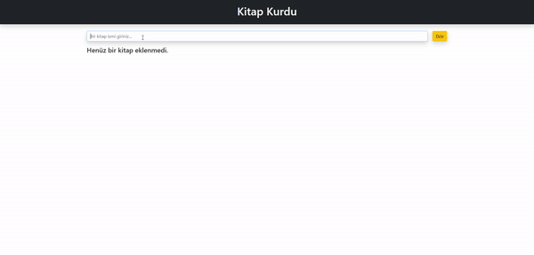

# React Book App

I created an book app site. In the design, I implemented the dynamics with REACT. 

I created the visual sections, which are also seen in the design, with Bootsrap. I prepared the dynamics separately for the states.
First, we add our book by entering the book name. Afterwards, I prepared buttons where we can change the reading status, edit the name of the book and remove the book.

<h2>Used Tech.</h2> 
<ul>
  <li>Bootstrap was used in design.</li>
  <li>React - Javascript was used in dynamics.</li>
</ul>

<h2>Screen</h2>

